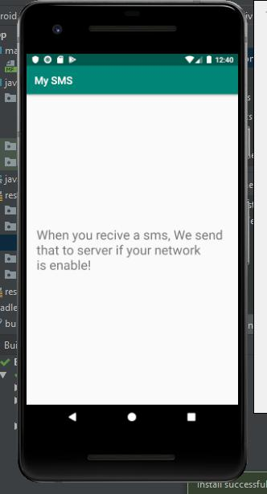

# Android My SMS Application

# MySMS Application

An android application to send sms for a cloud-based web service.

## TODO

- Store SMS in sqlite database (cache)
- Send SMS to webservice when your network connection is good
- Remove SMS from sqlite database after sent to server

---------

# Max Base

My nickname is Max, Programming language developer, Full-stack programmer. I love computer scientists, researchers, and compilers.

## Asrez Team

A team includes some programmer, developer, designer, researcher(s) especially Max Base.

[Asrez Team](https://www.asrez.com/)
